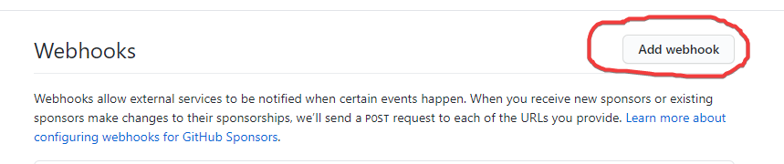
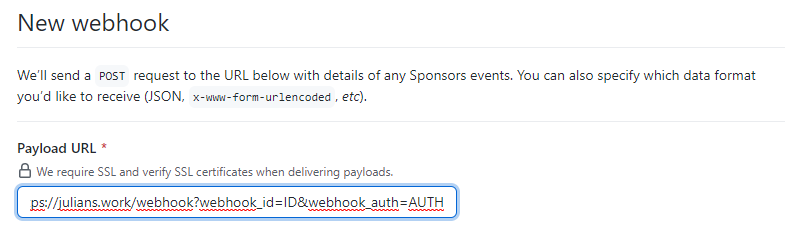
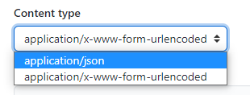
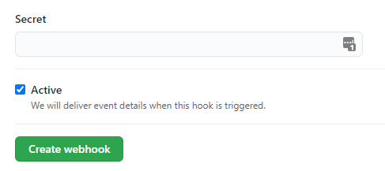
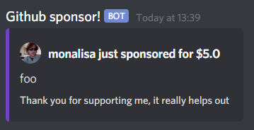

# How to use
1. Go to your [webhook dashboard](https://github.com/sponsors/NexInfinite/dashboard/webhooks)
2. Click on `add a webhook`  
3. Change the `payload url` to [this domain](#get-a-webhook)  
4. Change the Content type to `application/json`  
5. Leave `Secret` blank, keep `Active` checked and hit `Create webhook`  
6. Please note, the first time you do this you should get a message in your discord server. 
If this happens you have successfully completed the webhook. If not, please review you're steps or open an [Issue](https://github.com/NexInfinite/supporter-discord-webhook/issues).

# Get a webhook
To get your domain, open up discord and go to the channel you want your webhook to be sent to and go to `settings > Integrations > Webhooks` and click `new webhook`.
Customize this as much as you want and then hit `Copy Webhook URL`. 
This should look something like this `https://discord.com/api/webhooks/WEBHOOK_ID/WEBHOOK_AUTH`.
In the example domain I've used `WEBHOOK_ID` and `WEBHOOK_AUTH`. 
Copy these from your discord webhook and place them in this domain `https://julians.work/webhook?webhook_id=WEBHOOK_ID&webhook_auth=WEBHOOK_AUTH`. 
Congratulations, you now have a webhook that will work for discord. 
You can also add a variable `color` to the domain to get a custom colour on your embed. This must be in decimal so convert from hex to decimal. 

Your embed will look like this but the icon and title will change for the price of and user who supported you. 
`Foo` will also change to the description of your package. __More customizations coming soon__. 

# Please note
~~This is an idea and is a wip. Please check back to see progress or join my discord server to be announced when this goes live [here](https://julians.work/cum)~~
